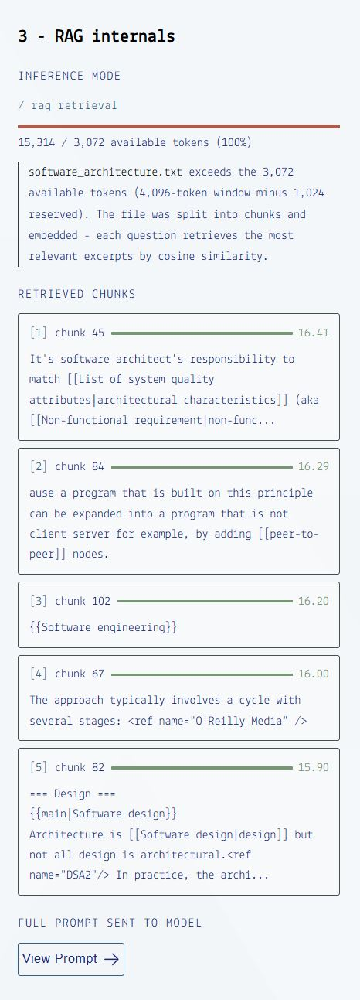

# WebLLM RAG - Ask Your Notes

A browser-native RAG system that runs entirely on your GPU - no server, no API key, your data never leaves your machine. Upload a .txt or .md file and ask questions about it. For files that fit in the model's context window, the full content is used directly. For larger files, the app falls back to retrieval-augmented generation with visible retrieval internals showing which chunks were retrieved and why.

# Project demo

View the live <a href="https://teduard.github.io/webllm-rag/">demo</a>

## How it works

### Adaptive inference

The app measures the token length of the selected file against the current
model's context window before answering any question. Based on this it works either through:

**Direct context** - if the file fits within the context window, its
full content is passed directly to the model. The model reads
everything at once, with no risk of retrieval missing relevant
sections. This is the preferred path and is used whenever possible.

**RAG fallback** - if the file exceeds the context window, the app
falls back to a retrieval-augmented generation pipeline. The file is
split into semantically coherent chunks, each chunk is embedded using
a dedicated embedding model (snowflake-arctic-embed-s, running on
WebGPU), and at query time the top-5 most similar chunks are
retrieved using cosine similarity and injected into the prompt.

### Architectural decision

Direct context is the default mode and is preferred over RAG when possible because this way there is no risk of missing out of useful information when chunks are selected.

The active mode is shown in the UI as a live indicator - you can see
exactly which path is being used and how much of the context window
your file occupies.

RAG quality depends on the embedding model's retrieval accuracy. The snowflake-arctic-embed-s model is fast and small but retrieval can miss relevant content for ambiguous questions. For files that fit in the context window, this is avoided entirely by using direct context. The RAG internals panel makes retrieval decisions transparent so you can see exactly which excerpts were used.

### In-browser LLM inference

Both the chat model and the embedding model run on your GPU via
WebGPU using [WebLLM](https://github.com/mlc-ai/web-llm). The
full inference pipeline runs inside a single browser tab.

Models are downloaded once (up to 1.6GB depending on selection) and
cached in browser Cache Storage. Subsequent loads are instant.

### Explainable retrieval

The RAG internals panel shows the current working mode, the selected chunks and allows to inspect the prompt sent to the model.



---

## Stack

| Concern                    | Library                    |
| -------------------------- | -------------------------- |
| LLM inference + embeddings | `@mlc-ai/web-llm` (WebGPU) |
| UI                         | React + TypeScript + Vite  |
| Styling                    | CSS Modules, heroicons     |

---

## Models used

| Model                  | Total size | Context window                      |
| ---------------------- | ---------- | ----------------------------------- |
| Snowflake arctic embed | 0.13 GB    | 512 tokens (max chunk input length) |
| SmolLM2 - 135M         | 0.26 GB    | 4096 tokens                         |
| Llama 3.2 - 1B         | 0.78 GB    | 4096 tokens                         |
| Gemma 2 - 2B           | 1.44 GB    | 4096 tokens                         |

Full list of available models available at <a href="https://github.com/mlc-ai/web-llm/blob/main/src/config.ts#L293">web-llm config.ts</a>

---

## Requirements

- Chrome(113+) or Edge(113+) (WebGPU required)
- GPU with sufficient VRAM for the selected model
- up to 1.6GB free disk space for model cache

---

### Known issues and limitations

The current approach of running RAG entirely in your browser, comes with several limitations:

- no support for mobile devices
- running the app the first time requires downloading LLM models
  and this means at least 0.39GB which can take a while.
- there is no persistence between sessions

---

## Run locally

```bash
npm install
npm run dev
```
